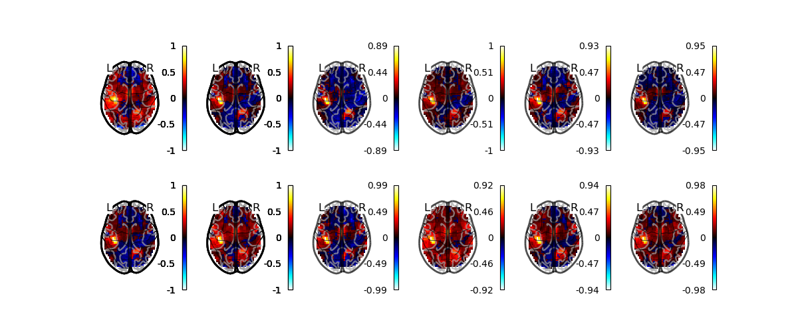

# Mitigating analytical variability through style transfer

This repository contains scripts to train and evaluate a conditional diffusion models to perform unsupervised image-to-image transition using conditioning on multiple target images on the latent space of a classifier. 

Selection of target images is implemented using random selection, K-means clustering and KNN identification. 

Conditional diffusion is inspired from ['Classifier-Free Diffusion Guidance'](https://arxiv.org/abs/2207.12598). 

<p align = "center">

</p>
<p align = "center">
<b>Figure 1.</b> Generated images for all transfers using CC-DDPM.
</p>


<table>
	<tr>
        <td></td> 
        <td></td>
        <td colspan=2>fsl-1 to spm-0</td>
        <td colspan=2>spm-0 to fsl-1</td>
        <td colspan=2>fsl-1 to spm-1</td>
        <td colspan=2>fsl-1 to fsl-0</td>
    </tr>
	<tr>
        <td></td> 
        <td>IS</td>
        <td>Corr.</td>
        <td>PSNR</td>
        <td>Corr.</td>
        <td>PSNR</td>
        <td>Corr.</td>
        <td>PSNR</td>
        <td>Corr.</td>
        <td>PSNR</td>
    </tr>
    <tr>
        <td>Initial</td>
        <td>3.69</td>
        <td>76.2</td>
        <td>78.2</td>
        <td>76.2</td>
        <td>78.2</td>
        <td>82.6</td>
        <td>81.3</td>
        <td>91.0</td>
        <td>83.9</td>
    </tr>
    <tr>
        <td>One-hot (Ho &amp; al., 2022)</td>
        <td>3.66</td>
        <td>83.8</td>
        <td>77.2</td>
        <td>75.0</td>
        <td>79.4</td>
        <td>78.7</td>
        <td>77.7</td>
        <td>81.1</td>
        <td>79.5</td>
    </tr>
    <tr>
        <td>N=1 (Preechakul &amp; al., 2022)</td>
        <td>3.70</td>
        <td>85.5</td>
        <td>79.0</td>
        <td>77.8</td>
        <td>80.0</td>
        <td>79.9</td>
        <td>78.0</td>
        <td>82.8</td>
        <td>80.2</td>
    </tr>
    <tr>
        <td>StarGAN (Choi &amp; al., 2018)</td>
        <td>3.63</td>
        <td><b>90.5</b></td>
        <td><b>81.9</b></td>
        <td><b>87.5</b></td>
        <td><b>84.2</b></td>
        <td><b>87.6</b></td>
        <td><b>81.8</b></td>
        <td><b>91.5</b></td>
        <td><b>85.0</b></td>
    </tr>
    <tr>
        <td>CCDDPM</td>
        <td><b>3.93</b></td>
        <td>86.1</td>
        <td>79.4</td>
        <td>79.0</td>
        <td>80.7</td>
        <td>81.2</td>
        <td>78.9</td>
        <td>84.1</td>
        <td>80.6</td>
    </tr>
    <tr>
        <td>N=5</td>
        <td>3.86</td>
        <td>86.4</td>
        <td>79.8</td>
        <td>78.7</td>
        <td>80.6</td>
        <td>81.2</td>
        <td>79.4</td>
        <td>84.5</td>
        <td>80.9</td>
    </tr>
    <tr>
        <td>N=20</td>
        <td>3.87</td>
        <td>86.1</td>
        <td>79.5</td>
        <td>79.2</td>
        <td>80.7</td>
        <td>81.3</td>
        <td>79.2</td>
        <td>83.9</td>
        <td>80.9</td>
    </tr>
    <tr>
        <td>N=5, random</td>
        <td>3.89</td>
        <td>86.5</td>
        <td>79.4</td>
        <td>79.1</td>
        <td>80.4</td>
        <td>82.0</td>
        <td>79.2</td>
        <td>84.2</td>
        <td>80.2</td>
    </tr>
    <tr>
        <td>N=10, random</td>
        <td>3.86</td>
        <td>86.5</td>
        <td>79.2</td>
        <td>79.0</td>
        <td>80.2</td>
        <td>81.8</td>
        <td>79.4</td>
        <td>84.3</td>
        <td>80.8</td>
    </tr>
    <tr>
        <td>N=20, random</td>
        <td>3.85</td>
        <td>86.7</td>
        <td>79.1</td>
        <td>79.3</td>
        <td>80.6</td>
        <td>81.5</td>
        <td>79.4</td>
        <td>84.4</td>
        <td>80.7</td>
    </tr>
    <tr>
        <td>N=10, KNN</td>
        <td>3.75</td>
        <td>84.9</td>
        <td>79.3</td>
        <td>78.7</td>
        <td>80.0</td>
        <td>81.6</td>
        <td>79.1</td>
        <td>83.6</td>
        <td>80.7</td>
    </tr>
</table>
<p align = "center">
<b>Table 1.</b> Performance associated with four transfers. IS means ”Inception Score” across all transfers. Pearson’s correlation (%) and Peak Signal to Noise Ration (PSNR) computed between generated and ground-truth target image for 20 images per transfer. Initial represents the metrics between the source image (before transfer) and the ground-truth target image. Boldface marks the top model. </p>

<p align = "center">

</p>
<p align = "center">
<b>Figure 2.</b> Generated images for two transfer and different competitors: conditioning with one-hot encoding (Ho & al., 2022), with a classifier and N=1 (Preechakul & al., 2022),  starGAN (Choi & al., 2018) and CCDPM.
</p>

## How to reproduce ? 

If you use pre-trained models, for each command used to evaluate performance, change `--model_param` to the path of the pre-trained classifier and `--model_save_dir` to the path of the directory containing the pre-trained diffusion models. 

### Classifier

#### Train
```bash
python3.10 -u main.py --model classifier --data_dir data --dataset dataset_rh_4classes --labels pipelines --model_save_dir results/models --batch_size 64 --lrate 1e-4 --n_epoch 150
```

#### Evaluate 

```bash 
python3.10 -u main.py --model classifier --data_dir data --dataset dataset_rh_4classes --labels pipelines --mode test --model_param ./results/models/classifier_b-64_lr-1e-04_epochs_150.pth
```

### Diffusion models 
#### Train 

```bash
python3.10 -u main.py --model cc_ddpm --mode train --dataset dataset_rh_4classes --labels pipelines --model_save_dir results/models --batch_size 8 --lrate 1e-4 --n_epoch 200 --n_classes 4 --sample_dir results/samples
```

#### Transfer

```bash
python3.10 -u main.py --model cc_ddpm --mode transfer --dataset dataset_rh_4classes --labels pipelines --model_save_dir results/models --test_iter 200 --n_classes 4 --sample_dir results/samples
```

### StarGAN

####  Train
```bash
python3.10 -u main.py --model stargan --mode train --dataset dataset_rh_4classes --labels pipelines --image_size 56 --c_dim 4 --batch_size 16 --data_dir data --sample_dir results/samples --model_save_dir results/models
```

#### Test
```bash
python3.10 -u main.py --model stargan --mode test --dataset dataset_rh_4classes --labels pipelines --image_size 56 --c_dim 4 --batch_size 1 --data_dir data --sample_dir results/samples --model_save_dir results/models --test_iters 100000
```
