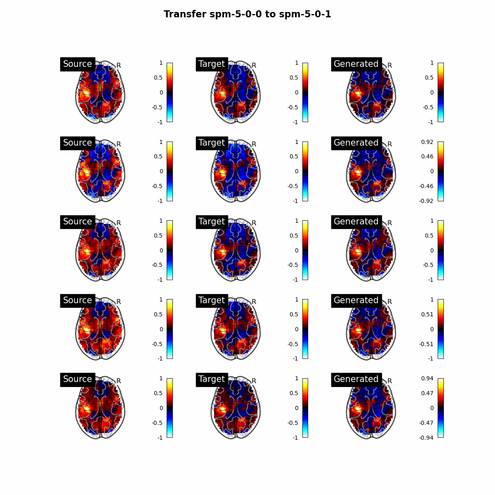

# Mitigating analytical variability through style transfer

This repository contains scripts to train and evaluate a conditional diffusion models to perform unsupervised image-to-image transition using conditioning on multiple target images on the latent space of a classifier. 

Selection of target images is implemented using random selection, K-means clustering and KNN identification. 

Conditional diffusion is inspired from ['Classifier-Free Diffusion Guidance'](https://arxiv.org/abs/2207.12598). 

<p align = "center">

</p>
<p align = "center">
Samples generated from the model.
</p>

## How to reproduce ? 

If you use pre-trained models, for each command used to evaluate performance, change `--model_param` to the path of the pre-trained classifier and `--model_save_dir` to the path of the directory containing the pre-trained diffusion models. 

### Classifier

#### Train
```bash
python3.10 -u main.py --model classifier --data_dir data --dataset dataset_rh_4classes --labels pipelines --model_save_dir results/models --batch_size 64 --lrate 1e-4 --n_epoch 150
```

#### Evaluate 

```bash 
python3.10 -u main.py --model classifier --data_dir data --dataset dataset_rh_4classes --labels pipelines --mode test --model_param ./results/models/classifier_b-64_lr-1e-04_epochs_150.pth
```

### Diffusion models 
#### Train 

```bash
python3.10 -u main.py --model cc_ddpm --mode train --dataset dataset_rh_4classes --labels pipelines --model_save_dir results/models --batch_size 8 --lrate 1e-4 --n_epoch 200 --n_classes 4 --sample_dir results/samples
```

#### Transfer

```bash
python3.10 -u main.py --model cc_ddpm --mode transfer --dataset dataset_rh_4classes --labels pipelines --model_save_dir results/models --test_iter 200 --n_classes 4 --sample_dir results/samples
```